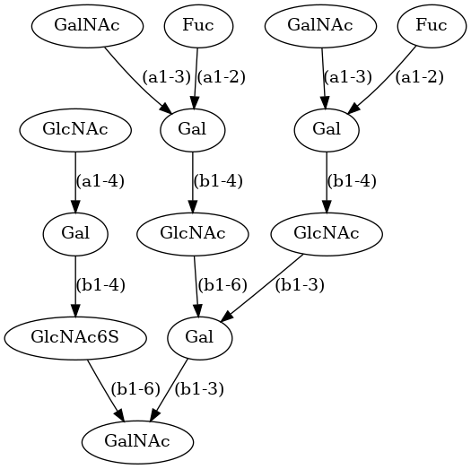
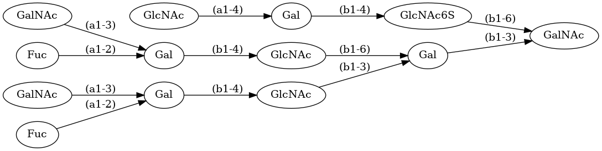

Visualization of Glycans on a Monomer Level
=====

We can use this also to compute a graphical representation of the glycans in form of a DOT-graph of the monomeric tree-structure in vertical orientation ...

.. code:: python

    glycan = Glycan("Fuc(a1-2)[GalNAc(a1-3)]Gal(b1-4)GlcNAc(b1-3)[Fuc(a1-2)[GalNAc(a1-3)]Gal(b1-4)GlcNAc(b1-6)]Gal(b1-3)[GlcNAc(a1-4)Gal(b1-4)GlcNAc6S(b1-6)]GalNAc", tree_only=True)
    glycan.save_dot("viz.dot")

... or in horizontal orientation.

.. code:: python

    glycan.save_dot("viz_2.dot", horizontal=True)

You can also get some statistics of a glycan

.. code:: python

    for k, v in glycan.summary().items():
        print(k, ":", v)

Output:

.. code:: console

    formula : C92H153N7O67S
    weight : 2459.850098435999
    atoms : 167
    bonds : 179
    rings : 13
    monomers : 13
    types : {'GalNAc': 3, 'GlcNAc6S': 1, 'Gal': 4, 'GlcNAc': 3, 'Fuc': 2}
    root : GalNAc
    leaves : ['GlcNAc', 'GalNAc', 'Fuc', 'GalNAc', 'Fuc']
    depth : 4